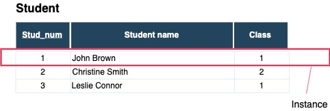

## Motivation and basic concepts 

What is a database?
---
## Omnipresence of databases
Databases in the core of almost all computer systems
- library catalogs, booking systems, ERP-systems
- multi-medial databases
- geographical information systems

### Basic operations
- Create 
- Read
- Update
- Delete

---

## Database - definition 
A database is a collection of related data:
1. which represents aspects of the part of real world, called
   the **universe of discourse** 
2. data has some **inherent meaning**
3. database is designed to be used for a **specific purpose**

Database is an organized collection of inter-related data that models
    some aspect of  the real-world

---
## Data storage requirements
- scalability
- performance even with big data sets
- ensuring data integrity
- concurrent access
- structural changes need to be easy to implement
- data protection

---
## Data storage requirements 2
- Massive
- Persistent
- Safe
- Multiuser
- Convenient 
- Efficient
- Reliable

Note: Convenient (physical data independence, high level query languages)

---

## Historical development of data stores
### 1950s punched cards and magnetic tapes
- access is only sequential 
- general sensitivity of mediums
- little capacity
 - capacity of a punch card 60 - 100 Bytes
   
 <!-- .element height="30%" width="40%" -->
 <!-- .element height="30%" width="40%" -->

---

## Historical development of data stores
### 1960s and 1970s: hard drives 
- saving data in logical units 
- direct access
- average access times 
- data manipulation significantly easier
  
 <!-- .element height="30%" width="40%" -->
---
##  
### Question 
Which functions should have an application for storing 
data of customers? 
How would you implement these functions?
---

## Historically first approaches 
1. traditional **file processing** (flat file applications)
 * each user has necessary files for its application
   * accounting office
   * grade reporting office
2. **database** approach 
 * single repository 
---

## File processing approach (storing data as a list)
 
Problems with using lists (anomalies):
- **Insertion problems**
 - inserting a new course with no students
- **Deletion problems**
 - deleting row with Leslie Connor we loose data about the course C++ programming
- **Update problems**
 - updating the name of a course requires updating it on all places
---

## Part of the university database  
Student table split in different tables 
- What is a difference between this and the previous case?  

---
## Flat file application 
- separate file per entity 
### Issues
- someone overwrites the year of students class with an
invalid string
- the lack of centralized application - everyone can change the file 
in some strange ways.
- inserting new data, enrolling students on a particular course
- finding a particular record (scanning all records)?
- creating a new application  that uses the same database in a new programming language 
- two threads try to write to the same file at the same time
---
## Flat file storage
- Databases in 60s and 70s 
- Tight coupling between physical and logical level
- Knowing which queries would be executed before designing the database
- each user implements files needed for a specific software application
- data definition is a part of the application programs
- some changes to the structure can require changing all programs 
---
## File based  data storage

Issues with storing data in simple lists 
- redundancy and inconsistency
- limited access 
- problems with multi-user access
- data loss in crashes  
- integrity breach
- security problems
- development costs

File based data storage lacks in flexibility.
---

## Database functions according to Codd
- Integration:
- Operations: CRUD 
- Catalog (Data dictionary / Meta-data ) 
- User views 
- Consistency
- Data protection
- Transactions
- Synchronization
- Security

---

## Database system environment
 <!-- .element height="50%" width="50%" --> 
---
## Database system environment (DBMS)
- Database system
- Database Management System
 - is a *general-purpose software* that enables defining, constructing, manipulating and sharing databases
 - examples:
 - PostgreSQL
 - Oracle database
 - MSSQL
 - MySQL
 - DB2
 - ...
- Matadata - data about data
- Applications access the data exclusively using DBMS
---
## Database concept
1. Self describing nature of a database system
 - use of a catalog to store the database description (meta-data)
2. Insulation between programs and data, and data abstraction  
 - **data abstraction**
    * **program-data independence**
    * **program-operation independence**
3. Support of multiple views of the data
4. Sharing of data and multiuser transaction processing
  - **concurrency control**
     * online transaction processing (OLTP)

Note: File-processing have information within a file-processing program
program-opration independence in object-oriented and object-rational systems 
Data model is a data abstraction which is used to implement conceptual 
representation

---
## Key people
- database administrators 
   - authorizing access
   - monitoring database use
- database designers
   - understanding requirements 
   - creating design
- end users 
   - parametric (naive users)
      - canned transactions
   - casual users - need different information 
   - sophisticated users
- system analysts  and application programmers   
- database system designers and implementers
- tool developers  
---

## Basic ideas of the Database concept
 - controlling redundancy
 - restricting unauthorized access 
 - providing persistent storage for program objects 
 - providing storage structures for efficient query processing 
 - providing backup and recovery 
 - providing multiple user interfaces 
 - representing complex relationships among data
 - enforcing integrity constraints 
 - permitting interfaces and actions using rules

 
Note: data type constraints, key constraints, referential integrity constraints 
key constraints.
permitting interfaces - triggers and stored procedures

---
##  Situations inadequate for DBMS
Sometimes DBMS represents overhead for the system 
 - embedded systems with limited storage capacity
 - systems with with no multiple-user access
 - many computer-aided design(CAD) tools  
 - communication and switching systems
 - GIS systems 

---
## Modern Database system architecture 
Basic client/server DBMS architecture
 - client module - designed to work on user workstations
    - application programs
    - user-friendly interfaces
 - server module - handles data storage, access, search and 
other functions
---

## Data abstraction  and data model
**Data abstraction** is generally a way to **suppress** details of data organization and storage 
to **highlight essential features** for an improved understanding of data

**Data model** - a collection of concepts used for **describing the structure** of a database in order to 
achieve data abstraction
 - data model includes 
   - description of data types, relations and constraints over data
   - description of basic operation for specifying retrieval and updates on the database 
   
- Data model is also related to Codd
Note: operations on the student table compute GPA

---

## Categories of data models 
1. Conceptual (high-level) data models 
 - entity-relationship model
 - object-data model 
2. Representational data models
  - Relational Algebra
3. Physical (low-level) data models  
   describe haw data is stored as files
   - record formats, record orderings, access paths
   - index is an example of of an access path 

Note: how about Relational-Calculus which is non-procedural
---
## Some Data Models  
- Relational 
- Kay/Value 
 - Redis
- Graph 
 - Neo4J
- Document 
 - MongoDb
- Column-family (HBase, Big Table )
- Array/Matrix 
- Hierarchical 
 -IBM IMS (IBM Information Management System)   
- Network 

---
## Database schema 
 Data models differentiate between
 - description of the database (**database schema**)
 - database itself

Database schemas are mostly represented using **schema diagrams** 

An object of the schema is called a **schema construct** (Student, Course)
---
## Database state 
**Database state** (snapshot) 
  - represents the data in the database at a particular moment in time
  - is also called current state of **instances** (occurrences)

An instance represent an individual entity (record) 

It is important to distinguish between database schema and database state

Note: Student table should be changed to have the Date_of_birth
---
## DBMS and database schema
DBMS system has a role to 
 - maintain every database state as a **valid state**
 - store schema constructs together with constraints 

Database schema is called **intesion**
 - it doesn't change so often 

Database state is called **extension** of the schema
 - it is changed constantly 
---
## ANSI/SPARC architecture (Three-Schema Architecture)
separates user applications from the physical database
- **internal level**
  - internal schema describes the physical storage structure 
  - internal schema uses physical data model to describe details
- **conceptual level**
  - conceptual schema describes entities, relationships, data types, 
    user operations and constraints 
  - representational data models used 
- **external (view) level**
  - external schemas (user views) describe the part of the database for
    a particular user group (typically used representational data models)

Most DBMS support three-schema to some some extent
---

## ANSI/SPARC architecture (Three-Schema Architecture)

---
## Data independence 
**capacity to change** the schema at one level of a database system
without having to change schema at the next higher level
- **Logical data independence**
  - capacity to change the conceptual schema without changing external schemas  
  or application programs
  - examples: adding or removing constraints, record types or data items
- **Physical data independence**
  - capacity to change the internal schema without having to change 
    the conceptual schema
  - examples: reorganizing physical files (creating additional access structures**
  - capacity to change 
  
Logical independence is harder to achieve
 - **mappings** between layers - to achieve data independence

Note: 1 views that don't use those records shouldn't be affected
      much stricter requirement
      2  improving the performance on retrieval and update 
         adding new access path (index on some fields)
---
## Database languages
**Data Definition Language (DDL)**
  - used by the DBA and database designers to  
  - a DBMS have a DDL compiler
  - most DBMS uses DDL to designe both conceptual and external 
    schemas

**Data Manipulation Language (DML)**     
 - used to manipulate the database (insertion, retrieval, deletion and modification of data )
 
Current DBMS use the practically the same language 
 -  used for conceptual schema definition,   
   view definition and data manipulation 
 - combination of DDL, VDL, DML, constraint specification, schema evolution
  and other features

---
## Data Manipulation Language (DML) 
- DML in DBMS can be: 
- high level 
 - such as **Structured Query Language (SQL)** 
  
   SELECT * FROM Student WHERE Class = "1" 
 - entered interactively or embedded in a general-purpose programming
   language
- low level (procedural)
 - must be embedded in a general-purpose programming language 
 - retrieves individual objects from database and process them 
   separately 
 - commands GET UNIQUE , GET NEXT, ...

---
## Query languages in general
Query languages can be categorized as:  
1. Non-Procedural (declarative) languages 
  - Relational-Calculus (formal query language)
    - {s | Student(s) ^ s.Class = "1**}
    - proposed first by Codd in 1970s
2. Procedural
  - Relational Algebra (formal)
  - SQL

updates are also considered as a part of a query language in DBMS

---
## DBMS interfaces
Different database users use different ways to interact with a database
- **Menu-Based Interfaces for Web clients** 
 - parametric (naive users) use mostly user-friendly interfaces
 - helpful not to memorize specific commands 
- **Form-based interfaces**
  - display forms with form field that should be filled and are 
  than matched in DBMS to retrieve matching data
- **Graphical user interfaces**
 - to display schema in diagrammatic form
- Specific interfaces for parametric users
- Natural language interfaces
- other interfaces
  - speech input and output, ...
Note: explain the figure on the page 41.
query optimizer uses 
runtime database monitor updates data manager with statistics
stored data manager using basic OS services 
---
## Classification of DBMSs
Main criterion for used for classification is the data model
- Relational Database Management Systems (RDBMS) 
 - **relational data model**
- object DBMSs 
 - **object data model**
 - not widespread
- Object-relational DBMSs 
 - more data models: relational, object, object-relational, hierarchical,
- Native XML DBMSs
  - 
- Hierarchical DBMSs 
 - **hierarchical data model**
 - example: IMS (IBM)
- Network DBMSs 
 - **network data model**
 - examples: IMAGE (Hewlett-Packard), SUPRA (Cincom)

 
---
## Review questions
  - What is a data model?
  - What is the difference between a database schema and a database state?
  - What is difference between logical and physical data independence?
  - Define the term database management system?

---

