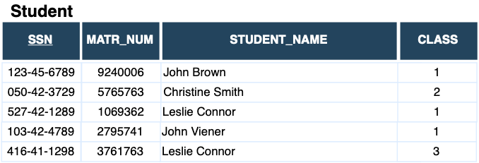
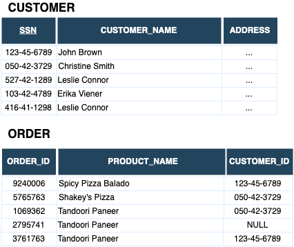
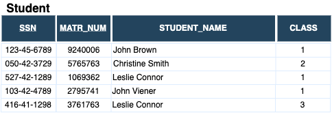

## Relational Data model

---
## Relational Model 
introduced by Frank Edgar Codd (1923-2003) 

- in the classic paper “A Relational Model for Large Shared Data Banks,” in 1970 

- Codd worked in IBM Almaden Research Center, St. Jose  
- ACM Turing Award in 1981 for ”fundamental and
continuing contributions to the theory and practice of
database systems“

<!-- .element style="font-size: 80%;" -->
Relational model: 
 - uses the concept of mathematical relation  
 - theoretical basis in **set theory** and **first-order predicate logic**

<!-- .element style="font-size: 80%" -->
To put it simple:
- Storing database in simple data structures (tables)
- Access data through a high-level language

<!-- .element style="font-size: 90%" -->
---

## Relational model concepts
Database represented as collection of **relations**
 - a table is called  a **relation**
 - a raw is called a **tuple**
 - a column is called an **attribute** 
 - a data type of possible values in a column is called a **domain**

---
## Domain   
Domain *D* is a set of atomic values 
 - atomic values are indivisible 
 - data types can be strings, integers, reals 
 - domains can also be specific set of values
  - zip codes
  - date of birth (dd-dd-dddd) with specific constraints 
   on this digits
  - age (must be integer number or zero)

---
## Relation schema, domain, attribute
A **relational schema** *R* denoted by $R=(A_1,A_2,...,A_n)$ is made of 
  * relational name *R* and 
  * a list of attributes $A_1, A_2,..., A_n$

An **attribute** $A_i$ is a role played by some domain $D$ denoted by $dom(A_i)$

The **degree** (or **arity**) of a relation is the number of attributes $n$ 

Example:
- *STUDENT (SSN, Name, Home_phone, Age, Address)*
- *STUDENT (SSN:string, Name:string, Home_phone:string, Age:integer, Address:string)*
  - here with specified domains

---
## Relation (relation state)
A relation state $r$ of a relation $R=(A_1,A_2,...,A_n)$ denoted as $r(R)$
is a **set** of tuples $r = {t_1,t_2,...,t_m}$
- tuple is an ordered list of $t = <v_1,v_2,...,v_m>$ $n$ values where each value 
- holds   $v_i \in dom(A_i)$ or $v_i\ is\  NULL$ as a special value

corresponding terms used:
- *relation intension* - for relation schema $R$ 
- *relation extension* - for relation state $r(R)$ 

A mathematical set has the following features:
 - does not have duplicate elements
 - there is no order among it's elements

---
## Binary relation - formally 
Given two sets $A_1$ and $B$. A binary **relation** over sets A and B is a 
*subset* of the *Cartesian product* A and B.
$$R \subseteq \\{A \times B\\}$$
 

Binary relation is an unordered set of ordered pairs.
$$ R\subseteq \\{(a_{1},b_{1}), ..., (a_k,b_k)\\}$$

---
## n-ary relation  
If $A_1, A_2,..., A_n$ are sets. An n-ary **relation** over sets $A_1, A_2,..., A_n$ 
is the *subset* of the *n-ary Cartesian product* of those sets.
$$R \subseteq \\{A_1 \times A_2 \times ... \times A_n\\}$$
 
In relational algebra it's called *relation state* and in a case of more sets  we 
have n-ary relation :
$$r(R) \subseteq (dom(A_1) × dom(A_2) × ... × dom(A_n))$$
- total number of values (rows), or **cardinality** is 
 
$|dom(A_1)| \times |dom(A_2)| \times ... \times |dom(A_n)|$  
where $|dom(A_i)|$ is the cardinality of $A_i$
- relation is a set of tuples which does not have any particular order
 - by contrast, in a file, tuples are physically ordered

---
## Interpretation of Relation 
Facts and relationships are both represented in relations 
According to relation model **relationships** are 
integrated into the relations 
  - some attributes contain values of attributes other relations  
   and that is how relationships are represented 
  - entities and relationships are represented *uniformly* 

**Closed world assumption** holds in the relation model
 - facts in the database are the only true facts in the universe 

---
## Null values
*NULL* value has several meanings
 - value unknown
 - value exists but is not available
 - attribute does not apply (value undefined)

Behavior of NULL values in comparisons and aggregations
 - if both A an B have NULL values it doesn't mean they
  have the same values

---
## Behavior of Nulls and AND 
Boolean logic truth tables with nulls:

 A     | B     | $A\land B$ 
:------|:------|------:
 $\top$ | $\top$ | $\top$ 
 $\top$ | $\bot$ | $\bot$
 $\bot$ | $\top$ | $\bot$
 $\bot$ | $\bot$ | $\bot$
 $\top$ | null | null
 null | $\top$ | null 
 $\bot$ | null | $\bot$
 null | $\bot$ | $\bot$
 null | null | null 
 
The logical expression with AND can never be true if one of the relations is undefined.
 - True and null gives an unknown value
 - however, can be false

---
## Behavior of Nulls and OR
Boolean logic truth table for the logical operator **OR** with nulls:

 A | B | $A\lor B$ 
:------|:------|------:
 $\top$ | $\top$ | $\top$ 
 $\top$ | $\bot$ | $\top$
 $\bot$ | $\top$ | $\top$
 $\bot$ | $\bot$ | $\bot$
 $\top$ | null | $\top$
 null | $\top$ | $\top$ 
 $\bot$ | null | null
 null | $\bot$ | null
 null | null | null

The logical expression OR can never be false if one of relations is undefined.
 - False and null gives an unknown value
 - however, can be true

Note: should be discussed with aggregations
---
## Key Constraints
Because relation is defined as a set of tuples it holds
 - all tuples in a relation must be distinct which can be 
 denoted as  
 $$t_i[R] \neq t_j[R],\ \forall i, j , i \neq j$$  
Usually there are other subsets of attributes with the property
that no two tuples in any relations state r of R should have 
the same combination of  values for these attributes

---
## Superkey
Def: Let SK be a set of attributes in a relation schema R.
If for any two distinct tuples $t_i$ and $t_j$  in a relation state r
of R holds
$$t_i[SK] \neq t_j[SK]$$
then such set of attributes is called a **superkey**

Superkey SK specifies *uniqueness constraint* 
 - relation can have many superkeys 
 - every relation has at least one superkey  
   What is that superkey? 
 - superkey can have redundant attributes. 
---
## Key
We are interested for those superkeys which don't have 
redundant attributes.

Def: A **key** *K* of a relation schema R is a superkey 
of R with the additional property that removing any
attribute *A* from *K* leaves a set of attributes $K'$
that is not a superkey of R any more.

Key satisfies two conditions:
1. no two tuples in any state of the relation can have 
identical values of all attributes in the key
2. it is a *minimal superkey* - such that removing any attributes 
from it violates the uniqueness constraint in condition 1.

a key is also a superkey but not vice versa

---
## Primary key and candidate keys 
A relation schema may have more keys and in that case we call them
**candidate keys**.

Def:A **Primary key** is one of candidate keys whose values are used
to identify tuples in the relation.
- we can denote primary key as underlined set of attributes
- other candidate keys which are not the primary key are called **unique keys** 
 
Name all possible candidate keys?
Note: Page 72 print and solve those exercises
---
## Primary keys and candidate keys
Relation: STUDENT(SSN, MATR_NUM, STUDENT_NAME,CLASS)   
<!-- .element style="font-size: 80%" -->
Superkeys:
- SSN, MATR_NUM, STUDENT_NAME, CLASS 
- SSN, MATR_NUM, STUDENT_NAME
- SSN, MATR_NUM, CLASS 
- SSN, STUDENT_NAME, CLASS 
- MATR_NUM, STUDENT_NAME, CLASS 
- SSN, STUDENT_NAME
- SSN, CLASS
- MATR_NUM, STUDENT_NAME 
- MATR_NUM, CLASS  
- SSN, MATR_NUM 

<!-- .element style="font-size: 50%" -->
Candidate keys
- SSN  
- MATR_NUM

<!-- .element style="font-size: 50%" -->
Primary key
- SSN

<!-- .element style="font-size: 50%" -->

---

## Foreign keys
Def: A set of attributes *FK* in relation schema $R_1$ is a **foreign key** of
$R_1$ that references relation $R_2$ if it satisfies the following rules:
1. the attributes *FK* **refer to** the relation $R_2$   
attributes in *FK* have the same domains as the primary key in $R_2$  
2. every tuple of $R_1$ **refers to** a tuple of $R_2$ 
$$t_1[FK] = t_2[PK]$$
i.e value of FK in any tuple $t_1$ in the current state $r(R_1)$ is either 
  some value of some tuple $t_2$ in the current state $r(R_2)$, or is NULL 

This constraint on relation schema is called **referential integrity constraint**

Foreign keys can also refer to its own relation

---
## Foreign keys example

Note: All students can make an example

---
## Functional dependency constraint
Given two sets of attributes X and Y. A **functional dependency** 
denoted by $X \rightarrow Y $, holds if :
$$\forall t_1,t_2 \in r(R) : t_1[X]=t_2[X]   \implies t_1[Y]=t_2[Y]$$
- values of X determine unique values of Y

In common parlance:
 - Y is functionally dependent on  X 
 - if two tuples agree on X values, they must necessarily agree on 
 their Y values
 
---
## Functional dependency example
 

The following holds:
* $SSN \rightarrow \\{ SSN, MATR\\_NUM, STUDENT\\_NAME, CLASS\\}$
* $SSN \rightarrow \\{ MATR\\_NUM, STUDENT\\_NAME\\}$
* $\\{SSN,MATR\\_NUM\\} \rightarrow \\{ MATR\\_NUM, STUDENT\\_NAME\\}$
* $\\{MATR\\_NUM\\} \rightarrow \\{ STUDENT\\_NAME, CLASS\\}$

<!-- .element style="font-size: 70%;" -->

---
## Functional dependency inference rules
* Reflexivity: $Y \subset X  \implies X \rightarrow Y$
* Augmentation: $X \rightarrow Y  \implies XZ \rightarrow YZ$
* Transitivity: $X \rightarrow Y \land Y \rightarrow Z \implies X \rightarrow Z$
* Decomposition: $X \rightarrow YZ \implies X \rightarrow Y \land X \rightarrow Z$
* Union: $X \rightarrow Y \land X \rightarrow Z \implies X \rightarrow YZ$
* Pseudotransitivity: $X \rightarrow Y \land WY \rightarrow Z \implies WX \rightarrow Z$

Comutativity doesn't hold
---

## Relational database schema 
Def: A **Relational database schema** *S* is a set of  relation schemas 
$$S=\\{R_1,R_2,...,R_n\\}$$ and a set of **integrity constraints** IC

Def:  A **relational database state** (or **relational database instance**)
of *S* is a set of relation states $$DB= \\{r_1,r_2,...,r_m\\}$$ such that 
$r_i$ is a relation state of $R_i$ and satisfy all constraints in IC. 

---
## Update operations   
 Operations on relational model can be categorized as retrievals and updates 
  - retrievals are explained in relational algebra
  - update operations
    1. Insert operations
    2. Update operation
    3. Delete operation 
---
