<div style="height: 120px;"></div>

# Relational Algebra  


---
## The foundation of relational algebra 
An *algebra* is a set of elements together with the operations that can be executed
over those elements. 
- example: set of integer numbers together with operators {+,*}
- the foundation is in the *set theory* 

**Relational algebra** is the basic set of operations for the relational model  
 - **relational algebra expression** 
   * composition of relational algebra operations
 - used as a basis for implementing and optimizing SQL queries
  - query trees


---
## Basic Operations in Codds papers

- Selection 
- Projection
- Union
- Intersection
- Difference
- Cross Join
- Join

Note: This is a set of operations on data
the basic set of operations for relational model is relational algebra
---
## Basic operations 
Unary operations
- Select $\sigma$ 
- Project $\pi$
- Rename $\rho$

Binary operations:
- Union $\cup$
- Intersection $\cap$
- Set Difference $-$
- Cartesian product (Cross Join) $\times$ 
- Join  $\bowtie$

---
## The Select operation  ($\sigma$)   
**Select** operation denoted by $\sigma$ 
is a subset of tuples from a relation that satisfies a selection condition.
- *restricts* the tuples in a relation to only those that satisfy the condition.
- general form: 
 $$\sigma_{\<selection-condition\>}(R)$$
- selection condition is a Boolean expression 
$\<attribute\\_name\> \<comparison\\_op\> \<constant\\_value\>$ or 
$\<attribute\\_name\> \<comparison\\_op\> \<attribute\\_name\>$
<!-- .element style="font-size: 70%;" -->
- can be considered as a *filter* that keeps only those tuples that satisfy a condition

The resulting relation has the same attributes as R
 - $\sigma_{Class="3"}(Student)$
 - $\sigma_{Salary>40000}(Employee)$
Note: horizontal partition
---
## Select - example
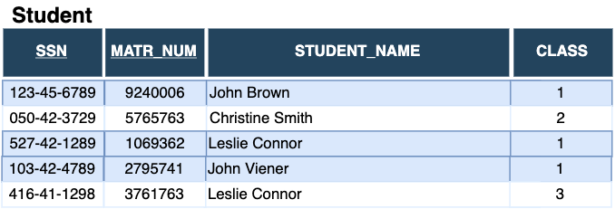

  $$\sigma_{Class="1"}(Student)$$

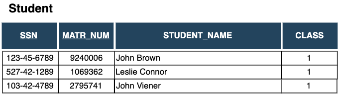
---
## Properties of the select operation     
- Select operation is commutative   
$\sigma_{\<cond1\>}(\sigma_{\<cond2\>}(R)) = \sigma_{\<cond2\>}(\sigma_{\<cond1\>}(R))$
- and it holds<br/> 
$\sigma_{\<cond1\>}(\sigma_{\<cond2\>}(R)) = \sigma_{\<cond1\> \land \<cond2\>}(R)$

in SQL, *select operation* is typically specified in WHILE clause (**not** in the SELECT clause):
```
  SELECT * 
  FROM EMPLOYEE
  WHERE DN0=4 AND SALARY > 30000 
```
  $$\sigma_{Dno="1"\ \land\ Salary>30000}(Employee)$$
  
Note: Here should give an example of a more complex operator

  $$\sigma_{(Dno="1"\ \land\ Salary>30000) OR (Dno="4" \land Salary>20000)}(Employee)$$
---
## The Project operation( $\pi$)
**Project** operation denoted by $\pi$ 
is a subset of columns from a relation
- it selects certain columns and discards the other columns
- general form: 
$$\pi_{\<attribute\\_list\>}(R)$$

The resulting relation has 
- attributes which are a subset of attributes in R
- tuples in the resulting relation cannot be duplicated
which is different from SQL (SQL uses DISTINCT to eliminate
duplicates)

Examples:
 - $\pi_{Student\\_name}(Student)$
 - $\pi_{LName, FName, Salary}(Employee)$
 


Note: vertical partition
---
## Project - example
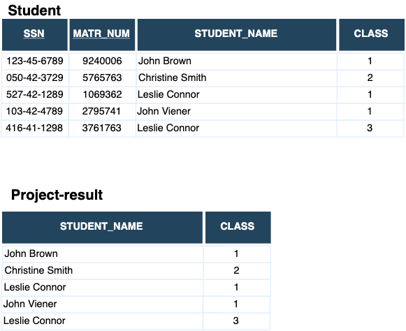
$Project-result \leftarrow \pi_{Student\\_name, Class}(Student)$

Note: Intermediate result naming is used
---
## The PROJECT operation( $\pi$)

If a list of attributes $\<list2\>$ contains attributes in  $\<list1\>$ 
$$\pi_{\<list1\>}(\pi_{\<list2\>}(R)) = \pi\_{\<list1\>}(R))$$
Relational algebra has relational expressions always as sets
- by contrast, SQL considers *multisets* or *bags*
- that's why corresponding SQL has to use DISTINCT
 to be equivalent to the project operation

```
  SELECT DISTINCT FName, LName, Salary 
  FROM EMPLOYEE
```
$$\pi_{FName,LName,Salary}(Employee)$$
If the keyword DISTINCT is removed we got all duplicates included


---
## The RENAME operation( $\rho$)
The **RENAME** operation renames either relation name or the attribute names or
both. 
- general form of the rename operation is 
$$\rho_{S\(B_1,B_2,...B_n\)}(R)$$
where $S$ is a new relation name and $B_1,B_2,...,B_n$
is a set of attributes

Other two forms contained in the first are:
- $\rho_{S}(R)$
- $\rho_{(B_1,B_2,...B_n))}(R)$

SQL uses aliasing **AS** to implement rename

```
  SELECT S.ssn AS s_ssn, S.matr_num as S.s_matr_num, S.student_name as s_student_name
         S.class AS s_class
  FROM Student AS S
```

---
## The RENAME operation - example
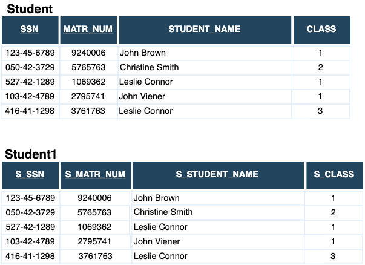
$\rho_{Student1(s\\_ssn,s\\_matr\\_num,s\\_student\\_name, s\\_class)}(Student(ssn,matr\\_num,student\\_name, class))$
<!-- .element style="font-size: 70%;" -->
---
## The Union operation
The Union operation, denoted by $R \cup Q$ 
$$R \cup Q := \\{r| r\in R \lor r \in Q\\}$$ 
is a relation that includes all 
tuples that are either in R or in S or in both R and S.  

Duplicates are eliminated


---
## Union - example
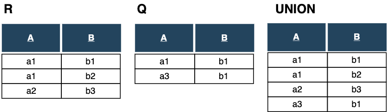


Two relations $R(A_1,...,A_n)$ and $Q(B_1,...,B_n)$ are union compatible if they 
 - have the same degree $n$ and
 - $dom(A_i) = dom(B_i),\ for\ 1 \leq i \leq n$ 

---
## The Intersection operation
The Intersection operation, denoted by 
$$R \cap Q:= \\{r| r\in R \land r \in Q\\}$$
is a relation that includes all 
tuples that are in both R and S.  
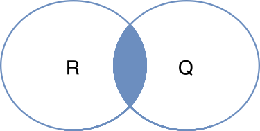


---
## Intersection - example
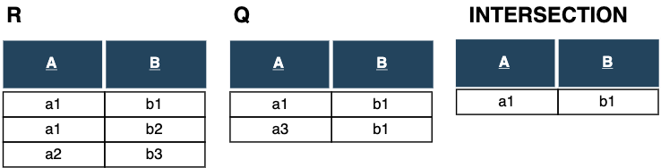

---
## The Set Difference (Minus) operation
The Set Difference (Minus) of relations $R$ and $Q$, denoted by 
$$R - Q:= \\{r| r\in R \land r \not\in Q\\}$$
is a relation that includes all tuples that are in R but not in Q.  

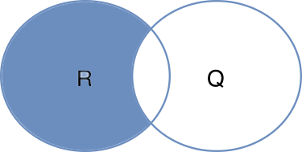
---
## Set Difference - example 
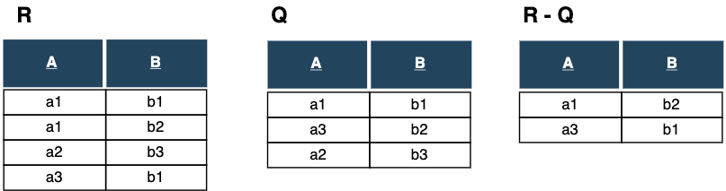

Question: Does it hold in general? <br/>
$|R-S| \geq |R| - |S|$
Note: Ask what is the cardinality of set difference?
---
## The Cartesian Product (Cross product)
Given relations $R(A_1,A_2,...,A_n)$ and $S(B_1,B_2,...,B_m)$.  
The **Cartesian Product (Cross product)**, denoted by $$R \times S$$ is a relation
$Q(A_1,A_2,...,A_n,B_1,B_2,...,B_m)$ with the degree $n+m$ and has all combinations of each tuple from the 
relation $R$ with all tuples from the relation $S$

Cardinality of the Cartesian product:
$$|R \times S| = |R|\cdot|S|$$ 

---
## Cross product - example
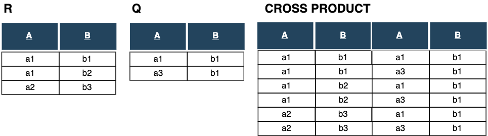

To extract related tuples cross product is often combined with
the SELECT operation and then it's called **JOIN**

IN SQL - JOIN is implemented by putting two (or more tables)
in the FROM clause without relation condition in the WHERE clause
or by using *cross join*
```
SELECT *
FROM Employee, Dependent
```
```
select *
from employee cross join dependent
```

Note: The importance of cross product together with select operator

---
## The JOIN Operation
Given relations $R(A_1,A_2,...,A_n)$ and $S(B_1,B_2,...,B_m)$.  
The **JOIN Operation**, denoted by $$R \bowtie_{\<join\\_condition\>} S$$ is a relation
$Q(A_1,A_2,...,A_n,B_1,B_2,...,B_n)$ that has $n+m$ attributes and has one tuple for 
each combination of tuples (one from $R$ and one from $S$) whenever 
the combination satisfies the join condition.

A general join condition is
- $\<condition\> AND \<condition\> AND...AND \<condition\>$

$\<condition\>$ is in the form $A\ \theta\ B $ where 
$\theta \in \\{=, \lt, \leq,\gt,\geq, \neq \\}$
- because of this general condition it's called also **THETA_JOIN**

---
## The JOIN operation - example

Formally JOIN can be expressed as a combination of cross product and select
operations:
$$R \bowtie_{\<join\\_condition\>} S =  \sigma _{\<join\\_condition\>} R \times S  $$

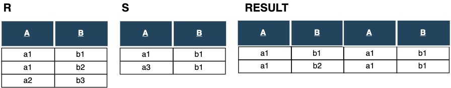
$$RESULT \leftarrow R \bowtie_{R.A=S.A} S $$

JOIN doesn't necessarily preserve all of the information in participating tables
---
## Variations of JOIN: EQUIJOIN and NATURAL JOIN
**EQUIJOIN** is a JOIN operation whose conditions has only comparison operator = 

**NATURAL JOIN**, denoted by (*) is an EQUIJOIN operation with removed duplicated attributes
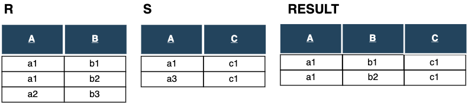
$$RESULT \leftarrow R \ast_{R.A=S.A} S $$


---
## Complete Set of Relational algebra operations
Set of the following relational algebra operations is **complete**:
- Selection ($\sigma$)
- Projection ($\pi$)
- Union ($\cup$)
- Rename ($\rho$)
- Set difference ($-$)
- Cartesian product ($\times$)

Any other relational algebra expression can be expressed using previous operations
- example: $R \cap S \equiv (R\cup S) - ((R - S) \cup (S - R)) $
- example: $R \cap S \equiv R - (R - S) $

--- 
## Other Relational algebra operations
Relational algebra operations that doesn't belong
to the set $\\{\sigma, \pi, \cup, \rho, -, \times \\}$
* such as different types of JOINS
* doesn't increase expressive power of relational algebra
* make the language more convenient

---
## OUTER JOIN operations 
Previous join operators match tuples which satisfy the join condition
and are called INNER JOIN
- tuples without a matching or with NULL values are eliminated

OUTER JOIN operations keep all the tuple in left or right relation or in
both of them, regardless of whether or not they match tuples in the 
other relation


---
## The LEFT OUTER JOIN operation
 


**LEFT OUTER JOIN** keeps every tuple in the left relation and when
there is no matching in the right relation it fills right relation 
attributes with NULL values 

---
## The RIGHT OUTER operations
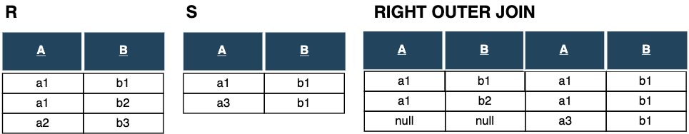
**RIGHT OUTER JOIN** keeps every tuple in the right(second) relation and when
there is no matching in the left relation it fills left relation 
attributes with NULL values 

---

## The FULL OUTER JOIN operation
**FULL OUTER JOIN** keeps every tuple in both the left and the right relations and when
no matching is found it fills attributes with NULL values  as needed 

How should full outer join $R\ ⟗_{R.A=S.A}S$ look like?
Fill the last two columns .
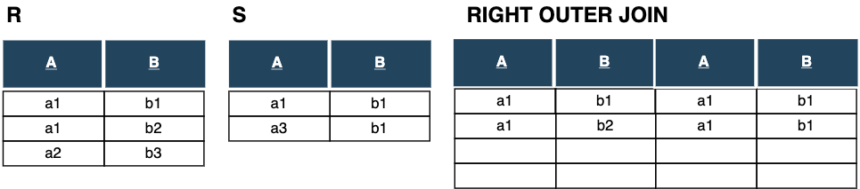

$$R\ ⟗ \ S = (R\ ⟕\ S) ∪ (R\ ⟖\ S)$$

---
## The DIVISION operation 
The **DIVISION operation**, denoted by $\div$ is applied to two relations R(Z),
and S(X) where $X\subset Z$ and gives as a result relation with attributes $Y=Z-X$.
A tuple t is in the result relation if tuples appear in R such  that $t_R[Y]=t$
$$ \forall t_S\in r(S) \implies \exists t_R\in r(R)\  t_R[X] = t_S$$ 

Example: *Retrieve the names of employees who work on all projects that "John Smith" works on.*<br/>
- dealing with *universal quantification* in queries


---
## Division operation example
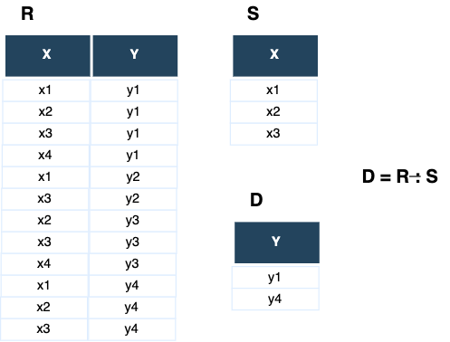

Can be expressed as a sequence of operations:
- $T1 \leftarrow \ \pi_Y(R)$
- $T2 \leftarrow \ \pi_Y((S \times T1) - R)$
- $D \leftarrow \ T1 - T2$

---

## Aggregate functions  
**Aggregate functions** are mathematical aggregate functions on collections 
of values
- COUNT
- SUM
- AVERAGE
- MAXIMUM
- MINIMUM

Common type of aggregate functions operation includes grouping  
attributes and then applies aggregate functions 
$$G\_1,G\_2,...,G\_m\ g\_{f\_1({A\_1}'), f\_2({A\_2}'),\dots,f\_k({A\_k}')}(R)$$
<!-- .element style="font-size: 90%;" -->
- $G\_1,G\_2,...,G\_m\$ grouping attributes
- $f\_1({A\_1}'), f\_2({A\_2}'),\dots,f\_k({A\_k}')$ aggregate functions
 on attributes in R

---
## Aggregate functions - example
Retrieve each department number, the number of employees in the department 
and their average salary
$$\rho(DNo,numEmployees,avgSalary) (_{DNo} g _{COUNT\ ssn,AVERAGE\ salary} (EMPLOYEE))$$
<!-- .element style="font-size: 70%;" -->


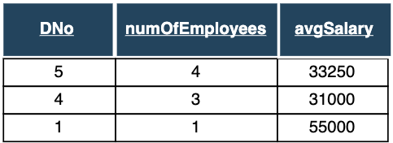

Aggregate functions cannot be expressed in basic relational algebra

---
## Review questions  
- The Intersection operation can be expressed using other operations?
  Explain how?
- Explain the $\theta$-JOIN operation. Where that name comes from?
- What is the result of NATURAL JOIN over two disjunct relations?
- Explain the cardinality of the cross product of two relations ?
