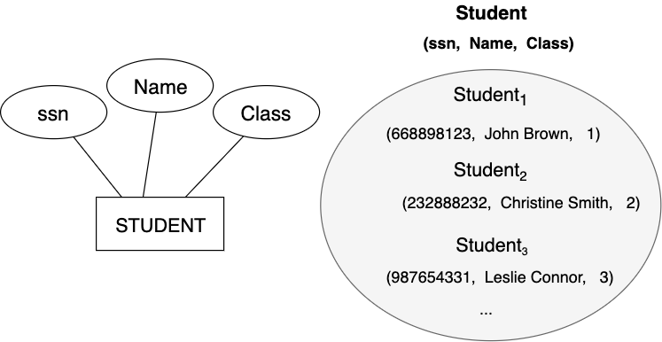

## Conceptual design 

---

## Database design 

Database represents aspects of the part of real world (universe of discourse - miniworld) 
- objects of the real world
- relationships between objects 
- constraints

Primary goal is to design a successful **database application** 
- database application is a collection of application programs 
- design and testing of application programs is a part of software engineering
- therefore **database design** is closely related to software engineering methods 

---
## Database design
**Database design**
- identification of the organization of necessary parts of the real world which are important for our
  database applicaton
- transforming that organization to a database schema

During database design it's important to:
- avoid redundancy - repeated data can easily lead to inconsistency 
- completeness - an incomplete model which is insufficient to model the part of 
  real world can lead to severe constraints during use of database application
  
Three **is not only one** successful database design.
- more correct database designs may exist for an aspect of a miniworld

---
## Database design - simplified overview 

---
## Database design - process
1. **Requirements collection and analyses**
 - database designers interview prospective database users to understand and document their
   data requirements
 - documentation in different forms (textual documents, data flow diagrams, UML diagrams,... )
2. **Conceptual design**
 - transforming requirements to a conceptual schema 
 - Output: **ER-diagrams**
3. **Logical design - data model mapping**
 - translation of the ER-model to an implementation data model of DBMS  
 - relational data model (expressed in SQL) 
4. **Physical design**
 - specifying internal storage structures, files, indexes, access paths and physical design parameters 

---
## ER modeling 
**Entity-Relationship (ER) model** is a popular high level conceptual data model
- different variations of this model used for conceptual design of data applications
- represents a blueprint of a database
- **ER-diagrams** - diagrammatic notation associated with the ER model  

---
## Sample Database Application
Requirements collection for the COMPANY database (page 72 in the textbook):
- The company is divided into departments. Each department has a unique name, 
  a unique number and particular employee who manages the department. A start date 
  when that employee began managing the department should be tracked. 
- Each department controls a number of projects, each of which has a unique name,
  a unique number, and a single location  
- An employee has it's name, Social Security number, address, gender, salary 
  and birth date. Employee is assigned to one department but may work on several 
  projects, which are not necessarily controlled by the same department. 
  We store the current number of hours per week that an employee works on 
  each project. Each employee can have a direct supervisor who is another employee.  
- Each employee can have it's dependents and we have to keep track of them for
 insurance purposes. Each dependent has first name, gender, birth date, and 
 relationship to the employee

<!-- .element style="font-size: 90%;" -->
---
## ER model elements
Main ER model elements are  
- **Entities** which represents objects from the real world
  - physical objects: students, cars, employees
  - conceptual objects: projects, companies,...
- **Attributes** are properties that describe objects (entities)
 - an employee has attributes: name, surname, gender, birth date
- **Relationships**  among entities

---
## Entity types and sets 
An **Entity type** is a *definition* of a collection of entities that 
have the same attributes. 
- each entity type is described by it's name and set of attributes
- represented as a rectangular box in ER diagrams
- represents schema or *intension* for a set of entities 

An **Entity set** is a collection of all entities of a particular 
 entity type in the database at any point in time.
- each entity has its own value for each attribute.
- represents extension of the entity type 
---
## Entity type and entity set - example

---
## Attribute categories
- **Atomic** attributes which are not divisible (ex. age, zip-code,... )
- **Composite** attributes (ex. Address - (Street_name, City, State and Zip-code))
- **Single-valued** attributes - at some point of time only one specific value 
    exists (ex. age) 
- **Multivalued** attributes - can contain more values at the same time (ex. 
College_degrees, Colors attribute for a two-tone car ) number of values can be restricted
- **Stored** attributes - are stored in the database
- **Derived** attributes, whose values can be derived from other attributes
  (age can be derived from the birth date or number of employees from employee table)
- **null** values in attributes can have different meaning (unknown, not applicable, 
   missing)
---
## Key attribute - example

---
## Key attributes
**Key attributes** is a set of attributes whose values are distinct for each
individual entity in the entity set
 - for the entity STUDENT, the attribute ssn is a key attribute
 - this property is called uniqueness property
 - composite attributes can have the uniqueness property but must be minimal
 - in ER-diagrams key attributes are underlined inside the oval
 - concept of primary key don't exist here - it is chosen during mapping to a 
   relational schema 

**Domain** of an attribute is a set of values that may be assigned to that attribute 
 - not displayed in ER diagrams

---
## Key attribute - example

An artificial or **surrogate** key can be introduced - in our case student_id 

Note: 
Recent changes in privacy laws have disallowed organizations from using
Social Security numbers to identify individuals unless certain restrictions are
satisfied. As a result, most U.S. universities cannot use SSNs as primary keys
(except for financial data). In practice, Student_id, a unique identifier
assigned to every student
---
## Preliminary design

---
## Relationship types, relationship sets an instances
- A **relationship instance** represents an association among entities 
$(e_1, e_2,...,e_n)$, where each $e_1, e_2,...,e_n$ belongs to an entity set.
- A **relationship set** is a set of *relationship instances* - is a mathematical relation. 
- A **relation type** defines a  *relationship set*. 
   - relationship types represented in ER diagrams as diamond-shaped boxes

Note: can be represented diagrammatically 

---
## Relationship degree, Role names
A **relationship degree** is the number of participating entity types in a 
relationship. 
 - relationship enrolled in the last example is of degree two (**binary**)
 - relationship of degree three is called **ternary** (example: relationship 
   supply - a supplier supplies a product to a project)
 - relationships can be of any degree but the most popular are binary relationships
 - each participating entity plays a role in the relationship 
 
Note: binary relationships can be considered as multivalued attributes 
works_for relationship either on the side of employee or on the side of 
the department

---
## Recursive relationships
A **recursive relationship** is a relationship in which some entity 
participates more than once
 - role of an entity is important (specifies the meaning that each participating
 entity plays)
 - an entity participates twice in an relationship - supervisor 

---
## Constraints on binary relationship types
Constraints limit the possible combination of entities in a relation and are 
determined from the miniworld

The following main types of constraints can be distinguished:
1. **cardinality ratio** constraints
 - specify the maximum number of relationship instances that an entity can 
 participate in
 - possible cardinality rations are **1:1, 1:N, N:1, M:N**  
2. **participation** constraints
 - specify the minimum number of relationship instances that each entity 
 can participate in
 - possible participation constraint values are **total** and **partial**  

---
## Cardinality ratio constraints 
- **1:1** an department has only one manager (an employee can manage one 
department only and a department can be managed by one manager only  )
- **1:N**  each can be related to any number on the other side ( a department can 
have many employees but one employee can work for only one department ) 
- **M:N**  each student can be enrolled in many courses, and each course can 
have many enrolled students

In ER-diagrams, cardinality is represented by numbers next to the 
diamond representing the relationship
        
---
## 1-1 cardinality relationship  

---
## 1-N cardinality relationship  

---
## M-N cardinality relationship  

---
## Participation constraints
Participation constraints are called minimum cardinality constraints 
- **total participation** 
  (or *existence dependency*) and is displayed in ER diagrams
  as a double line connecting participating entity type to the relationship
  - in our example every ORDER_ITEM must belong to some ORDER entity 
  

- **partial constraint** is represented as a single line which means that 
 there is no minimum constraint (in our example an ORDER entity can exist 
 without ORDER_ITEM entities)

---
## Attributes of relationship types

- Attributes of relationship types 1:N and 1:1 can migrate to participating 
  entities.
   - for 1:1 relationships to any of the two entities 
   - for 1:N relationships can migrate only to the entity on the N-side  
   - for M:N relationships must be specified as relationship attributes

---
## Ternary or higher degree relationships  
In general, relationship type of degree n have n edges in an ER diagram 
- n-ary relationship can be broken down into more relationships of
smaller degree
- sometimes by introducing an artificial surrogate key ternary relationship is transformed
 to a regular entity type.

---
## Weak entity types
A **weak entity type** is an entity type that does not have key attributes 
 - entities belonging to a weak entity type are identified by being related
 to specific entities from another entity type (in combination with one of their
 attribute values)
 - that entity type is called **identifying** or **owner entity type** and 
   relation is called identifying relation of the weak entity type.
 - weak entity type has always *total participation* with respect to its
   identifying relationship 
 - a weak entity type has a **partial key** which uniquely identifies weak entities
   to some owners entity
 - In ER diagrams weak entity types and their identifying relationship are 
   denoted by boxes and diamonds with **double lines** or they can be displayed
   as composite attributes
 
Note:
 - not every existence dependency results in a weak entity type
 - owner can be also a weak entity type
---
## Weak entity type and identifying relationship type

---
## Generalization/ specialization 
- **Generalization** is a way to represent subgroups of an entity type 
which are important for the database application.
 - an entity cannot exists just in a subclass
 - generalization/specialization is denoted as **is-a** or **part-of**

Note:  
If a subclass has few specific (local) attributes and no specific relationships, it
can be merged into the superclass. The specific attributes would hold NULL
values for entities that are not members of the subclass. A type attribute
could specify whether an entity is a member of the subclass.
---
## Refinement the ER Diagram

---
## Conceptual design choices
The names of should convey the meanings of constructs
- entity types should have singular names and  
- sometimes is difficult to decide whether a particular concept should be 
modeled as an entity type, an attribute, or a relationship type. 

Database design is an iterative refinement process
- Refinement process from an initial design 
 - attribute is transformed to a relationships
 - attribute existing in several entity types promoted to an entity type
- Inverse refinement
 - entity type demoted to an attribute 
 
Note: demoted if we have department only mentioned in the student entity type
## Symbols

---

## Different notations
- Chen-notation (notation that we use, proposed by Peter Chen 1976)
- UML notation 
 - similar to class diagrams
 - inheritance 
 - there are no relationships with degree n>2
- Crow's Feet notation
 - similar to UML notation
---
## Review questions
- When an attribute of a binary relationship type can become an attribute
of the participating entity types?
- What is a recursive relationship type?  
- What is a weak entity type? 
- What is a composite attribute?
