## Logical design 

---

## Logical design 
**Logical design** is a process of transforming a conceptual schema to the data model 
corresponding to a DBMS tool  
 - represents a **mapping** from an ER model to a Relational Model  
CASE tools create schema graphically and generate DDL from ER-models. 
 
**Algorithm** for ER-to-relational mapping transforms:
- Entity types (strong and weak)
- Attributes
- Binary relationships
- n-ary relationships and other constraints

---
## ER model to a Relational Model
- an entity set corresponds to a relation schema
- an entity corresponds to a tuple   
- a relationship can be expressed using foreign keys

The following slides present a mapping algorithm in 8 steps.

---
## 1. Mapping of Entity types
For each strong entity type E algorithm creates a relation R:  
- relation R includes all simple attributes of E
- simple component attributes of a composite attribute mapped to attributes of R
- *one key* of E chosen to be the primary key of R 
- knowledge about other keys useful to specify secondary unique keys 
 for indexes

--- 
## Mapping of Entity types - example

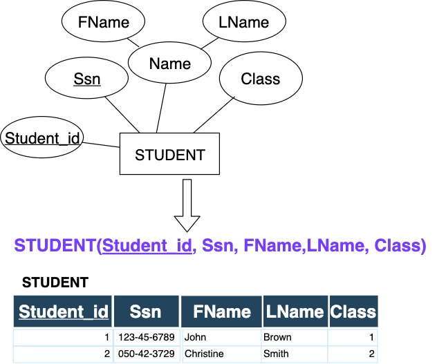
---
## 2. Mapping of weak entity types
For each weak entity type W with an owner type E algorithm creates a relation R with
- simple attributes (and simple parts of composite attributes) of the weak entity 
  type as attributes of R 
- foreign key to the primary key of relation corresponding E   
  (mapping identifying relation)
- primary key of R comprised of the foreign key to the primary key of the relation
  corresponding E and partial key of W   

The owner of a weak entity should be mapped before the weak entity
to have its primary key determined.

propagate (CASCADE) for the referential triggered action
on the foreign key is common in the relation 
 - ON UPDATE CASCADE  ON DELETE CASCADE 

---
## Mapping of the weak entity - example

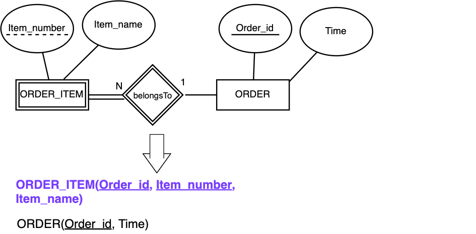

foreign key (Order_id) references ORDER(Order_id)

primary key {Order_id, Item_number}
---
## 3. Mapping of 1:1 Binary Relationship Type 
There possible approaches (first used whenever it's possible):
1. **foreign key** approach 
 - one of entities participating in the relationship get a foreign key to
   the primary key of relation corresponding to the other entity
 - foreign key on the side with total participation
2. merged relation approach 
  - merging the two entity types and the relationship into a single relation  
  - applicable only in the case when both participations are total  
3. relationship relation approach
  - new *relationship relation* (lookup table) created with primary 
 keys of corresponding entities as foreign keys. 
  - only one of foreign keys is primary key of the lookup table

---
## Mapping of 1:1 Binary Relationship Type - example
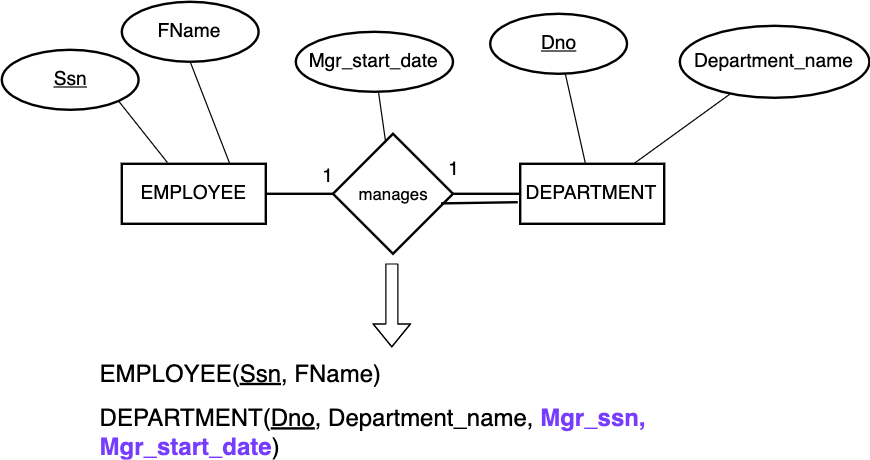
foreign key (Mgr_ssn) references EMPLOYEE(Ssn)

---
## 4. Mapping of Binary 1:N Relationship Type  
Relation which corresponds to the entity type on the N side of the relationship is 
changed:
 - included as foreign key the primary key of the other relation. 
 - included all simple attributes of the 1:N Relationship  

Alternative option is used rarely:
- creating relationship relation (lookup table) 
as in the case of 1:1 relationships. 
- used when only few 
tuples participate in the relationship to avoid excessive NULLs
 
---
## Mapping of Binary 1:N Relationship Type - example 

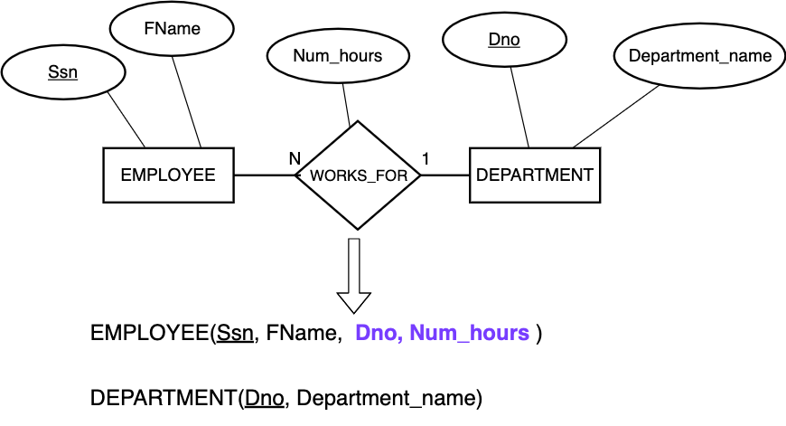
foreign key (DNo) references DEPARTMENT(DNo)

---
## 5. Mapping of Binary M:N Relationship Type  
A new relationship relation which corresponds to the 
relationship type is created and within that relation:
 - included as foreign key the primary keys of the relations that represent 
   the participating entity types. 
 - *combination* of foreign keys formed primary key of the relationship relation  
 - included all simple attributes of the M:N Relationship type  

Propagation (CASCADE) for the referential triggered action
on the foreign keys is common in the relation 
 - ON UPDATE CASCADE  ON DELETE CASCADE 

---
## Mapping of Binary M:N Relationship Type - example 

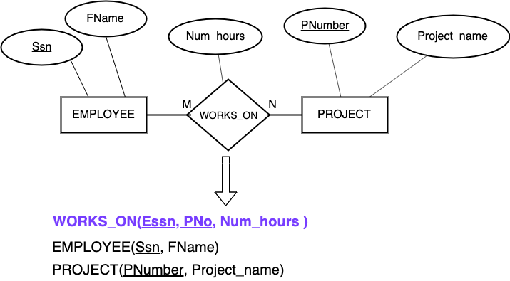
- foreign key (PNo) references PROJECT(PNumber)
- foreign key (Essn) references EMPLOYEE(Ssn)
- primary key {Essn, PNo}

---
## 6. Mapping of Multivalued Attributes 
A new relation is created for each multivalued attribute
 - included as foreign key the primary key of the relation which 
   corresponds to the basic entity type of the multivalued attribute
 - primary key is comprised of the foreign key to the basic entity and 
   the attribute which corresponds to multivalued attribute
 - included simple components if the multivalued attribute is composite

Propagate (CASCADE) for the referential triggered action
on the foreign keys is common in the relation 
 - ON UPDATE CASCADE  ON DELETE CASCADE 

When the multivalued attribute is composite only some of 
the component attribute should be part of the primary key
(multivalued attributes correspond to weak entity types)

---
## Mapping of Multivalued Attributes - example
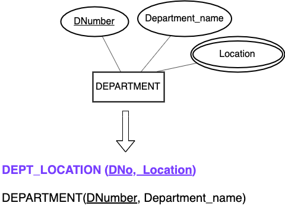

foreign key (DNo) references DEPARTMENT(DNumber)

primary key {DNo, Location}

---

## 7. Mapping of n-ary  Relationship Types  
Situation is similar to M:N Relationship types. A new relation is 
created and in it:
 - included as foreign key attributes the primary keys of the relations 
   representing participating entity types
 - included simple attributes and simple components of composite attributes
 of the relationship type 
 - primary key is *usually* a *combination* of all the foreign keys
   - exception -  if one of entity types participates with the cardinality
   constraint 1 than corresponding foreign key is excluded form the 
   primary key
---
## Mapping of n-ary  Relationship Types - example 

---

## 8. Mapping Generalization/Specialization  
Three appraches:
1. Multiple relations - superclass and subclasses  
  - primary key of subclasses is the same as primary key of the superclass 

2. Multiple relations - subclass only
  - only in those cases when each attribute of the superclass belongs to 
    some subclass
  - recommended when subclasses are disjoint

3. Single relation with one or more discriminating attributes
  - **type** or **discriminating** attribute whose value
    indicates which subset the tuple belongs to 
  - only when subclasses are disjoint 
  - potential for generating many null values

Note: In our example male and female employees
---
## Generalization example

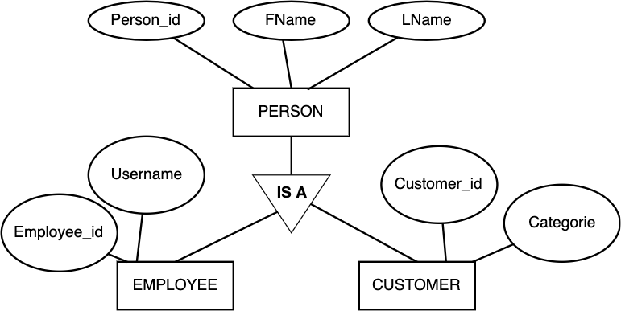

---
## Generalization - superclass and subclasses 

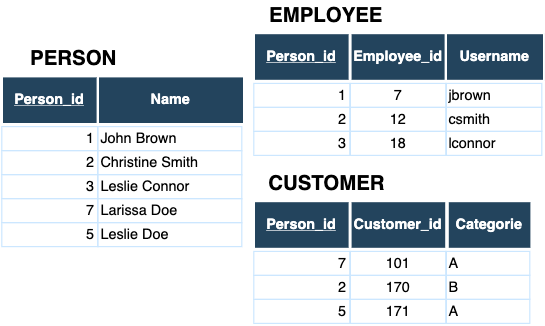

There exist relations for all entities
- Person_id is the primary key in all relations. 
- Data retrievals  require more join operations. 

---
## Generalization - only subclasses 

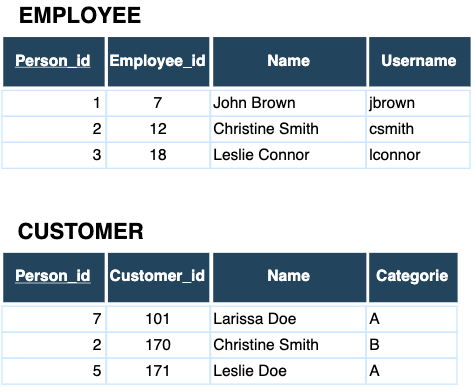

Relation corresponding to the person entity type doesn't exist. Attribute Person_id is the primary 
key for both relations. 

---
## Generalization - single relation 

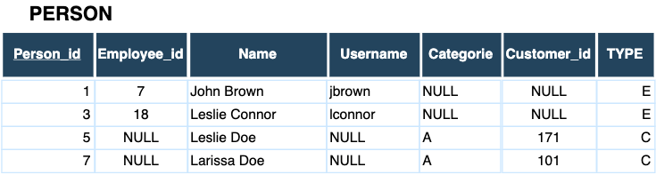

Only single relation corresponding to all entity types
- relation contains many null values and is not easy for maintenance
- one attribute is the type attribute 

---
## Summary
Mapping of elements
- Entity type $\rightarrow $ Entity relation
- 1:1, 1:N relationship type $\rightarrow $ One foreign key (or relationship relation) 
- M:N relationship type $\rightarrow $ Relationship relation and two foreign keys  
- n-ary relationship type $\rightarrow $ Relationship relation and n foreign keys  
- Multivalued attribute (and weak entity) $\rightarrow $ Relation and foreign key  
- Simple attribute $\rightarrow $ Attribute
- Key attribute $\rightarrow $ Primary (or secondary) key 
- Generalization $\rightarrow $ Multiple relations (or combination of all 
   attributes in a single relation) 

---
## Review questions
What is wrong with the following logical database mapping?
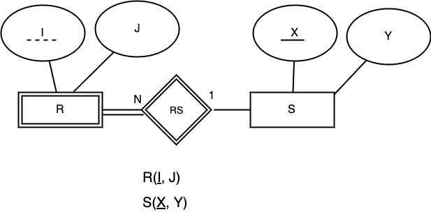
