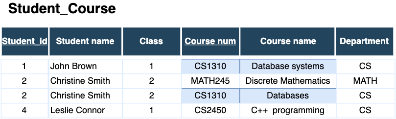
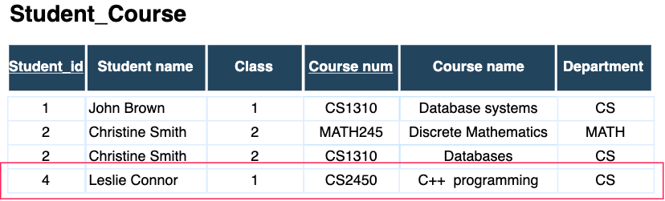
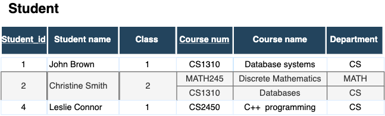
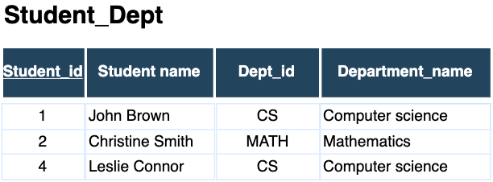
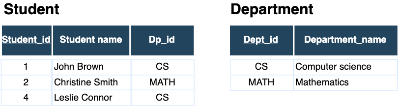
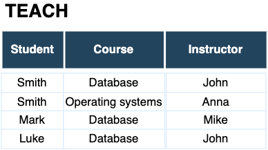
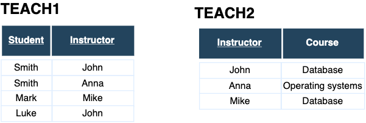
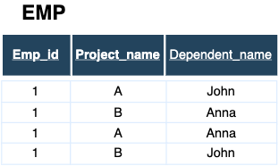
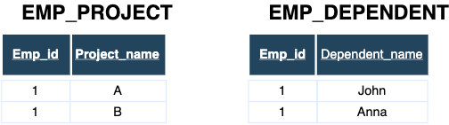

# Normalization


---
## Informal design guidelines 
- Ensure that the attributes in relation schema have clear semantics 
- Reducing redundant information in tuples
- Reducing the number of NULL values in tuples
- Disallowing the possibility of generating spurious data

---
## Anomalies

Grouping attributes into relation schemas has a significant effect on storage space

**Anomalies** are consequences of inappropriate database design
 - Insertion anomalies 
 - Deletion anomalies
 - Update anomalies 
 
---
## Insert anomalies


Inserting a new course with no students 
 - NULLs should be in fields belonging to the student properties  
 - what to do with the primary key attributes? <br/>
    course data cannot be inserted without student data
    (otherwise violation of the primary key constraint)

---

## Update anomalies


Changing the name of a course requires changing it in all tuples 
 - only a single typo will lead to inconsistency
---
## Delete anomalies


Deleting the student with the Student_id=4  
- loss of information for the course with the number CS2450

---
## Problems with too big and too small relations  
too big relations ("fat" relations with many attributes) 
 - writing  queries easily but suffer from anomalies 
 - mixing of multiple entities and relationships makes 
   semantic ambiguities (relation cannot be easily explained)
 - probably having many null values when attributes do not apply 

too small relations (just a couple of attributes)
 - writing queries is costly with many joins 
 - semantics of entities is decomposed

---
## Guidelines 
General guidelines
- avoid anomalies
  - avoid mixing attributes from distinct real world entities
- avoid placing attributes whose values may frequently be null  
 - make sure that that NULLs apply only in exceptional cases
 - selection, join and aggregation operations are difficult if we have null 
  values 
- avoid join by matching attributes that are not (primary key, foreign key) combinations
   - this avoids spurious tuples

Guidelines are sometimes violated to improve efficiency of queries 
 - tables with ignored guidelines are called *materialized views* and are used beside base relations  
 
Note: an example with new table if we have for instance only 15 % of people with 
values of a particular attribute
---
## Normalization
**Normalization** is the process of structuring a relational database in accordance
to series of rules - called **normal forms**.
  - in the process of normalization tests are applied over relations
   and if relations don't meet requirements they are **decomposed** into smaller relations

**Decomposition** should preserve the following properties:
1. nonadditive join or lossless join property 
  - no spurious data 
2. dependency preservation property
 - each functional dependency is represented in some individual relation

First property must be achieved at any cost. Second can be sometimes violated

---
## Normal forms
Normal forms are rules that should be followed to get a good database design.
  They are based on:
 - functional dependencies
 - multivalued dependencies
 
In practice relations should satisfy 3NF or BCNF or at most 4NF
 - practical utility of higher normal forms is questionable 
   because their constraints are hard to detect

Note: practical utility of 4NF and 5NF becomes questionable. 
---
## Functional dependencies
In order to introduce normal forms we use functional dependencies.
Functional dependencies are used as a generalization of keys  
- Trivial functional dependencies
  - $A \rightarrow B \qquad   B \subseteq A   $
- Nontrivial functional dependencies
  - $A \rightarrow B\qquad     B \nsubseteq A$
- Completely nontrivial functional dependencies
  - $A \rightarrow B\qquad   A \cap B = \emptyset    $

Closure of a set of attributes under a set of  functional dependencies?

Important fact to differentiate **key** and  **non-key** attributes
 - an attribute is a *key attribute*  if it is a member of some 
 candidate key
 - an attribute is called a *non-key attribute* if it's not a key attribute
---
## Closure of the set of attributes under a set of functional dependencies
Consider a set of attributes X and a set of functional dependencies F.
A closure of X under F is a set of all attributes that are functionally 
dependent on X.

One way to find functional dependencies is the following algorithm: 
```
Input: A set F of functional dependencies on a schema R and X a subset of 
attributes of R. 
  X+ = X;
  repeat 
   oldX+ = X+;
   for each functional dependency Y -> Z in F do
    if X+ ⊇ Y then X+ := X+ ∪ Z
  until (X+= oldX+)
```
---

## First Normal Form (1NF)
A relation is in the **first normal form** if the domain of each attribute
has atomic values and the value of any attribute in a tuple is a *single value* from the domain 
 - 1NF disallows relations within relations or relations as attribute values 
   in tuples

1NF disallows nesting of relations
 - EMP_PROJ(Ssn, Ename, {POJECT(Pnumber, Hours)})
 - excludes multivalued and composite attributes 
  - EMPLOYEE(Ssn, {Car_license_num}, {Phone_num}) <br/>
   becomes <br/>
   EMPLOYEE(Ssn, Car_license_num, Phone_num)
---
## 1NF - example 

Example of relation which is not in 1NF



Solutions 
 - decomposition in small tables for multivalued attributes
 -  introducing new tuples  
 
Note: Here we can mention multivalued attributes
---
## Second Normal Form (2NF)
Second normal form is based on the concept of full functional dependency. 

A relation schema R is in the **second normal form** if it's in 1NF and every non-key attribute is 
fully functionally dependent on any candidate key of R

A functional dependency $X \rightarrow Y$ is a **full functional dependency**
if dependency doesn't hold if we remove any attribute from X. 

A functional dependency is a **partial functional dependency** if it's not full
functional dependency


Definition implies that if relation is in 1NF and there is no candidate key with more 
attributes then it's already in 2NF.

---
## Second normal form


Student_course table has a primary key $\\{Student\\_id, Course\\_num\\}$
 - $\\{Student\\_id, Course\\_num\\} \rightarrow Student\\_name$

However, we have  $\\{Student\\_id\\} \rightarrow Student\\_name$
  - partial functional dependency

Testing for 2NF
 - involves testing for functional dependencies on the
   parts of a candidate key (here the primary key)

---
## 2NF normalized relation 
Normalization by decomposition of relation  
 - into a number of relations with non-key attributes and the part of the key on which they are fully functionally dependent


---
## Third normal form (3NF) 
A relation schema R is in 3NF if it satisfies 2NF and there is no non-key attribute of 
R which is **transitively dependent** on a candidate key

Transitive functional dependency 
 - $\\{X \rightarrow Z  \land Z \rightarrow Y\\} \implies X \rightarrow Y  $

For the 3NF,  Z should be non-key attributes 

Is the following relation in 3NF?



$Student\\_id\\ \rightarrow Dept\\_id$ and $Dept\\_id \rightarrow Department\\_name$
<!-- .element style="font-size: 80%;" -->

---

## Decomposing into 3NF 
3NF normalization by decomposing a not normalized relation into two relations in 3NF 
- for a functional dependency $\\{X \rightarrow Z  \land Z \rightarrow Y\\} \implies X \rightarrow Y  $
   - {X, Z} attributes in the first table 
   - {Z, Y} in the second table 


JOIN operation will recover original relation without spurious data

---
## 3NF alternative definitions

A relation R is in 3NF if every non-key attribute meets the following conditions
- it is fully functionally dependent on every key of R
- it is non-transitively dependent on every key of R

Or 

A relation R is in 3NF if, whenever nontrivial functional dependency 
$X \rightarrow A$ holds in R then it holds either:
 - a) X is a superkey or R 
 - b) A is a key attribute of R
---
## Boyce-Codd Normal Form (BCNF)
A relation schema R is in BCNF if for any nontrivial functional dependency 
 $X \rightarrow Y$ that holds in R, X is a superkey of R.


Alternatively if no attribute is transitively  dependent on a candidate key  
 


$\\{Student, Course\\} \rightarrow Instructor$

$ Instructor \rightarrow Course$

here an instructor teaches only one course
--- 
## Boyce-Codd normalization



Decomposition
 - loses functional dependency $\\{Student, Course\\} \rightarrow Instructor$
 - preserves lossless join property (no spurious data with join)  
 
---
## Multivalued dependency 

A multivalued dependency $X\ \twoheadrightarrow\ Y$ on relation schema R 
where $X,Y \subset R$ and $Z = R-(X \cup Y)$ holds if for two tuples in r(R) holds $t_1[X] = t_2[X]$ 
then should also $t_3$ and $t_4$ exists such that 
  * $t_1[X] = t_2[X] = t_3[X] = t_4[X]$
  * $t_3[Y] = t_1[Y]$ and  $t_4[Y] = t_2[Y]$
  * $t_3[Z] = t_2[Z]$ and  $t_4[Z] = t_1[Z]$

If $X\ \twoheadrightarrow\ Y$ then $X\ \twoheadrightarrow\ Z$ and we can write $X\ \twoheadrightarrow\ Y|Z$
<!-- .element style="font-size: 80%;" -->


Relations having nontrivial multivalued dependencies tend to be all-key relations

---
## Fourth Normal Form (4NF) 
A relation schema is in the **Fourth Normal Form** (4NF) with respect to a set of dependencies F (functional
and multivalued dependencies ) if, for every nontrivial multivalued dependency 

$X\ \twoheadrightarrow\ Y$ holds that X is a superkey for R  

Multivalued dependencies are a consequence of the 1NF
 - EMPLOYEE(Ssn, {Car_license_num}, {Phone_num}) <br/>
   has become <br/>
 - EMPLOYEE(Ssn, Car_license_num, Phone_num) <br/>
 where holds: <br/> $Ssn\ \twoheadrightarrow\ Car\\_license\\_num$ <br/>
 $Ssn\ \twoheadrightarrow\ Phone\\_num$
 

---
## 4NF decomposition
If $X\ \twoheadrightarrow\ Y|Z$ holds in a relation R then the decomposition  
splits its attributes in two relations :
 - R1(X,Y)
 - R2(X,Z)

which are both in 4NF.




---
# Review questions

- Does it hold in general, that if a relation is in 3NF then it is also in BCNF? 
- Is a relation R(A, B, C) with the set of functional dependencies $AB \rightarrow  C$ and $C \rightarrow B$ is in BCNF?
- If in a relation R(A,B,C) holds $A \rightarrow  B$. Does it hold $AC \rightarrow  B$ in that case? Which 
 set of attributes is a key of this relation?
