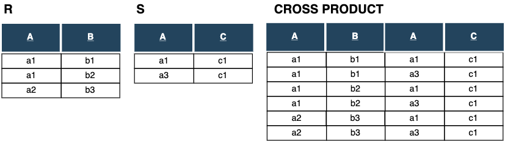

# SQL


---
## Structured Query Language (SQL) 
- Standard language for commercial relational DBMSs
- originally called **SEQUEL** - (Structured English QUEry Language ) 
- designed in IBM Research for an experimental DBMS called SYSTEM R

SQL standards 
- SQL-86 (SQL1)
- SQL-92 (SQL2)
- SQL:1999 (SQL3)
- SQL:2003 
- SQL:2006 
- SQL:2008 

New standards comprised of a core and extensions

---
## SQL structure 
Sql commands can be categorized in two groups
1. DDL - Data Definition Language
 - commands to create schemas, relations
 - commands to create domains and other constructs 
  (trigger, views, assertion, constraints)
2. DML - Data Manipulation Language
 - data retrieval and modifications
   insert, delete , update

SQL uses terms 
- relation - > **table**
- tuple - > **raw**
- attribute - > **column**
  
---

## SQL as a declarative language 


SQL is a declarative language
 - In contrast to relational algebra SQL specifies 
only what it wants and not how it should be done

Declarative approach:
``` 
SELECT * FROM STUDENT
WHERE Class_num = 2;
```

Imperative approach (python like syntax): 
``` 
students = read_students();
for student in students  :
    if  student.Class_num == 2:
        print(student)      
```
SQL statements can be implemented in different ways

---
## Database and database schema
A **database** is a collection of tables and other constructs and is the main 
container on an SQL environment.

```
CREATE DATABASE  University ;
```
<!--.element style="margin-left: 20px; font-size: 70%"-->
In PostgreSQL and many other RDBMS, a **database schema** is a namespace that
contains named database objects, views, indexes, etc. 
 - a database may contain one
or multiple schemas.
- some DBMSs such as MySQL equates the notion of schema and database 

```
CREATE SCHEMA administration;
```
<!--.element style="margin-left: 20px; font-size: 70%"-->

---
## CREATE TABLE statement
The **CREATE TABLE** is used to specify a new relation (table)
```
CREATE TABLE  table_name(
 attr1    type_1,
 attr2    type_2,
 ...
 attrn    type_n
);
```

Attributes have specific names and data types from the set of data types 
supported by the DBMS (int, char, varchar, etc.)
```
CREATE TABLE  Student(
 Ssn    int,
 Fname  varchar(50),
 Lname  varchar(50),
);
```
Attributes are ordered in the sequence in which they are specified in 
the CREATE TABLE command

---
## Attribute Data Types and Domains
Basic data types available for attributes

Numeric 
 - INT or INTEGER, SMALLINT 
 - FLOAT or REAL, DOUBLE PRECISION
 - DECIMAL(i,j), DEC(i,j), NUMERIC(i,j) formatted numbers
 
Character-strings
 - CHAR(n) or CHARACTER(n)  - fixed legth
 - VARCHAR(n) or CHARACTER VARYING(n)  - varying legth 
  - characters entered  in single quotation marks (case sensitive)
 - CLOB (CHARACTER LARGE OBJECT) (postgres uses TEXT instead of CLOB)


---

## Attribute Data Types and Domains
Bit-strings
- BIT(n) , BIT VARYING(n)
-  BLOB or BINARY LARGE OBJECT or (BYTEA in PostgreSQL) 
   used for storing images and other multimedia files

Boolean 
 - BOOLEAN - with two possible values TRUE and FALSE

Date 
 - DATE (in the form YYYY-MM-DD)
 - TIME ( with 10 positions of in the form HH:MM:SS ex. '09:12:47' )
 - DATETIME (TIMESTAMP postgresql)  (year, month, day, hour, minute, second and second parts  ) 
   '2019-12-12 09:12:47.242'
 
---
## Declaring a new data type (domain)

```
CREATE DOMAIN SSN_TYPE as CHAR(9)
```
<!--.element style="margin-left: 20px; font-size: 70%"-->
New data type (domain) can be easily changed  
 - for instance more characters in our example
 
The CHECK clause can be used to further specify domain
```
CREATE DOMAIN EMPLOYEE_AGE AS INTEGER
CHECK (EMPLOYEE_AGE > 15 AND EMPLOYEE_AGE < 90); 
```
<!--.element style="margin-left: 20px; font-size: 70%"-->

---

## Specifying constraints
Basic constraints specified as part of table creation after domain declaration
- PRIMARY KEY  - specifies that an attribute is a part of the primary key
- UNIQUE - attribute must be unique, but not part of the primary key - specifies secondary keys 
- NOT NULL  - nulls are not permitted for a particular attribute <br/>
(NOT NULL is implicitly specified for attributes of the primary key)
- DEFAULT - specifies a default value for an attribute (if DEFAULT is not 
  specified, the default value is NULL for those attributes not having NOT NULL clause )
- CHECK - restricts attribute or domain values
- REFERENCES  - specifies foreign key on the other relation


---
## CREATE TABLE - example
```
CREATE TABLE Student (
	Ssn CHAR(9) PRIMARY KEY,
	Matr_num CHAR(7) UNIQUE,
	Fname VARCHAR(45) NOT NULL,
	Sname VARCHAR (45) NOT NULL,
	Class_num INT CHECK (Class_num > 0 and Class_num < 5) 
          DEFAULT 1,
	Dept_code VARCHAR(4) REFERENCES Department (Dept_code)
);
```
<!--.element style="margin-left: 20px; font-size: 70%"-->

In this CREATE TABLE statement 
 - Ssn - specified as the primary key
 - Matr_num - matriculation number is a secondary key
 - first name and last name are specified not to be NULL  
 - Class_num - the class of the student can be (1, 2, 3, or 4) and
 a default value is 1 (freshman)
 - Dept_code - represents a foreign key to the table Department 

---
## Constraints on Tuples using CHECK
Tuple based  constraints
- checked whenever a tuple is inserted or modified

```
CHECK (Class_num > 0 and Class_num < 5) 
```
<!--.element style="margin-left: 20px; font-size: 70%"-->

Operators used with CHECK
 - comparison operators  =, <, <=, >, >=, <>
 - [NOT] IN (\<list of values\>)
 - [NOT] BETWEEN (\<range of values\>)  - *(inclusive)*
 - [NOT] LIKE (\<text pattern\>)

Example:
```
CREATE TABLE  EMPLOYEE(
...
age int CHECK (age BETWEEN 16 AND 80)
);
```
<!--.element style="margin-left: 20px; font-size: 70%"-->
---
## Key, entity and referential integrity constraints
The following example shows:  
- how to specify primary keys with more attributes
- foreign keys using the foreign key clause

```
CREATE TABLE DEPT_LOCATION (
 Dept_number int not null, 
 Dept_location varchar(20) not null, 
 PRIMARY KEY (Dept_number, Dept_location),
 FOREIGN KEY (Dept_number) REFERENCES Department(DNumber)
);
```
<!--.element style="margin-left: 20px; font-size: 70%"-->

 UNIQUE constraint on more attributes is specified in the same way as PRIMARY KEY 


---
## Primary and foreign key constraints specified explicitly 
```
CREATE TABLE DEPARTMENT (
 DNumber int , 
 Mgr_ssn char(9) not null,
 ...
 CONSTRAINT DEPTPK
  PRIMARY KEY(DNumber),
 CONSTRAINT DEPTUNIQUE
  UNIQUE(DName), 
 CONSTRAINT DEPT_MGR_FK 
  FOREIGN KEY (Mgr_ssn) REFERENCES Employee(Ssn)
      ON DELETE SET DEFAULT      
      ON UPDATE CASCADE
);

```
<!--.element style="margin-left: 20px; font-size: 60%"-->

In this example we specified 
- constraint names explicitly 
   - PostgreSQL, in contrast to some other systems, does not require constraint names to be unique within a schema (but only per-table)
- *referential triggered action* to the foreign key
---
## Referential triggered actions 
The **referential triggered actions** can be attached to any foreign key 
1. **ON DELETE** - specifies how to respond to the delete of the referenced row 
  - CASCADE - deletes all rows(records) related to the deleted row in the referenced table 
  - SET NULL / SET DEFAULT - set values in the current table to be null or a default value, respectively 
  - NO ACTION - referential integrity constraint will be violated and the delete  operation will be rejected 
2. **ON UPDATE** - specifies how to respond to the update operation of the primary key in the referenced row 
  - CASCADE - update values in rows to be the same as changed primary key values in the referenced table 
  - SET NULL / SET DEFAULT - set values in the current table to be null or a default value, respectively 
  - NO ACTION - referential integrity constraint will be violated and the update operation will be rejected 

<!--.element style="margin-left: 10px; font-size: 90%"-->


---

## DROP commands 
DROP commands  are used to delete a database or database elements such an index, table or view
- DROP DATABASE  database_name
 - this action deletes database and catalog entries 
 - cannot be undone and should be used with caution
 - we have to be connected to another database to execute DROP DATABASE statement
- DROP TABLE  table_name
  - removes an existing table from the database
 - all content of a table will be deleted and it cannot be undone 

---
## The ALTER table commands
The ALTER table commands are used to change already created tables
and it can be used to:
 - add new columns 

```
ALTER TABLE table_name
ADD new_column_name column_definition ;
```
<!--.element style="margin-left: 20px; font-size: 75%"-->

 - rename a table, change a column or remove columns 
 
```
 ALTER TABLE table_name
  RENAME TO table_name1 ;
```
<!--.element style="margin-left: 20px; font-size: 75%"-->

```
ALTER TABLE table_name
  ALTER COLUMN column_name TYPE column_definition ;
```
<!--.element style="margin-left: 20px; font-size: 75%"-->
```
ALTER TABLE Employee
  RENAME COLUMN old_name TO new_name,
  DROP COLUMN column_name;
```
<!--.element style="margin-left: 20px; font-size: 75%"-->

---
## Adding constraints using ALTER table 

ALTER table statement can be used to add a new constraint such as a foreign key
 - specially useful for self referencing and creation of foreign keys 
    which couldn't be created in CREATE TABLE statements

```
ALTER TABLE  table_name
  ADD CONSTRAINT fk_constraint_name 
    FOREIGN KEY (column_1) REFERENCES parent_table(column_2);
```
<!--.element style="margin-left: 20px; font-size: 75%"-->
- adding the primary key as constraint

```
ALTER TABLE  table_name
  ADD PRIMARY KEY (column1_name, column2_name, ...);
```
<!--.element style="margin-left: 20px; font-size: 75%"-->
-  To drop a constraint we use:

```
ALTER TABLE  table_name
  DROP CONSTRAINT constraint_name; 
```
<!--.element style="margin-left: 20px; font-size: 75%"-->


---
## The INSERT command
The INSERT INTO command is used to add tuples to a relation (rows to a table)
 ```
INSERT INTO STUDENT(S_id, Matr_num, Student_name, Class) 
VALUES (1, 9240006, 'John Brown', 1) ;
```
<!--.element style="margin-left: 20px; font-size: 70%"-->
In the previous example explicit attribute names are specified 
 - values are listed in the same order as the attributes 
 - all not specified attributes are set to their DEFAULT or to NULL 
 - if the attribute list is not specified then values should be listed
 in the same order in which attributes were specified in the CREATE TABLE command 

```
INSERT INTO STUDENT 
VALUES (1, 9240006, 'John Brown', 1) ;
```
<!--.element style="margin-left: 20px; font-size: 70%"-->
---
## The INSERT command variations 
The INSERT statement can insert multiple tuples in the single command
```
INSERT INTO STUDENT(S_id, Matr_num, Student_name, Class)
VALUES 
(1, 9240006, 'John Brown', 1), 
(2, 5763576, 'Christine Smith', 2) ,
(3, 1069362, 'Leslie Connor', 1) ;
```
<!--.element style="margin-left: 20px; font-size: 60%"-->
Second variation of the INSERT statement can use a query to populate 
a relation with values
```
INSERT INTO FRESHMAN(S_id, Matr_num, Student_name)
SELECT S_id, Matr_num 
FROM STUDENT 
WHERE Class = 1;
```
<!--.element style="margin-left: 20px; font-size: 60%"-->
---
## The UPDATE command  
The Update command is used to modify attribute values of one or more 
selected tuples
- SET clause specifies attributes whose values should be modified 

```
UPDATE STUDENT
SET Class = 3
WHERE S_id = 2; 
```
<!--.element style="margin-left: 20px; font-size: 80%"-->

If we want to increment the class of all students 
then we change SET statement in the following way where: 
- Class attribute on the left side represents the new value
- Class attribute on the right represents the old value
- WHEN clause is missing

```
UPDATE STUDENT
SET Class = Class + 1; 
```
<!--.element style="margin-left: 20px; font-size: 80%"-->

---
## The DELETE command  
The DELETE command is used to remove  one or more 
selected tuples from a relation
- includes WHERE clause similar to that used in an SQL query 
- deletes from only one table at a time (can propagate to other tables if 
referential triggered actions are specified ) 

```
DELETE FROM STUDENT
WHERE S_id = 2; 
```
<!--.element style="margin-left: 20px; font-size: 80%"-->

If WHERE clause is missing then all rows in the table are to be deleted
```
DELETE FROM STUDENT;
```
<!--.element style="margin-left: 20px; font-size: 80%"-->


---
## Basic SQL queries 

A basic SQL statement or a **select-from-where** block 
has the following form:

```
SELECT [DISTINCT] <attribute list>
FROM <table list>
WHERE <condition>;
```
<!--.element style="margin-left: 20px; font-size: 100%"-->


 - *\<attribute list\>* list of attributes that should be retrieved by the query 
 - *\<table list\>*  list of tables required to process the query  
 - *\<condition\>*  conditional (Boolean) expression that identifies the tuples to be retrieved by the query 

Basic logical operators used for comparing attributes and literal constants in the where clause are: <br/>
 =, <, <=, >, >=, <>

---
## Simple SQL example
```
SELECT DISTINCT Student_name
FROM Student
WHERE Class=1;
```
<!--.element style="margin-left: 20px; font-size: 80%"-->
- SELECT clause corresponds not to the projection but to the selection from the relational algebra
 -  attribute list contains attributes of the projection
- WHERE clause contains conditions which  are specified within the selection operator in the relational algebra
- DISTINCT clause eliminates duplicates

---
## SQL queries and Relational algebra   
The following example represents correspondence between relational algebra and SQL queries
```
  SELECT DISTINCT FName, LName 
  FROM Employee
  WHERE DNo=4 AND Salary > 30000; 
```
<!--.element style="margin-left: 20px; font-size: 80%"-->

  $$\pi_{FName, LName}(\sigma_{Dno="4"\ \land\ Salary>30000}(Employee))$$
 

---
## Simple SQL queries  
If an SQL query  doesn't have WHERE clause, it returns all tuples (WHERE condition is allways true)
- since DISTINCT is omitted it returns all duplicates of FName and LName values

```
  SELECT FName, LName 
  FROM Employee
```
<!--.element style="margin-left: 20px; font-size: 80%"-->
If in a query,  SELECT clause has only * then the query returns all attributes 
```
  SELECT * 
  FROM Employee
  WHERE DNo=4 AND Salary > 30000; 
```
<!--.element style="margin-left: 20px; font-size: 80%"-->


---
## Substring pattern matching SQL queries  
Partial character pattern matching can be done in SQL using LIKE comparison 
operator. Two special characters are important for string pattern matching.  
 - character % - replaces arbitrary number of zero and more characters  
 - character _ - replaces a single character 

Example: Retrieve all students whose address is in Mannheim.
```
  SELECT Student_name
  FROM Student
  WHERE Address LIKE '%Mannheim%' 
```
<!--.element style="margin-left: 20px; font-size: 80%"-->


---
## ORDER BY clause  
Tuples in the relational model are not ordered because they belong to a set of 
tuples

In contrast, SQL queries give us the possibility to order the result of a query by 
the values of one or more of the attributes using the ORDER BY clause
```
  SELECT DISTINCT FName, LName 
  FROM Employee
  ORDER BY FName ASC, LName DESC
```
<!--.element style="margin-left: 20px; font-size: 80%"-->


 - attributes in the ORDER BY clause appear in the query result
 - ascending and descending order can be explicitly specified using 
 keywords **ASC** and **DESC**
 - the default order is in ascending order of values (applied when the order 
   is not specified)
---
## Rename operation using AS (aliasing)
SQL allows the user to rename a relation, attributes or both. 

```
SELECT S.ssn AS s_ssn, 
       S.first_name ||' '|| S.last_name as s_name,
       S.class AS s_class
FROM Student AS S
```
<!--.element style="margin-left: 20px; font-size: 70%"-->

- Aliasing corresponds to the rename operation in the relational algebra 
$$\rho_{S\(B_1,B_2,...B_n\)}(R)$$
- FROM clause can contain rename of the table with all attributes 

```
FROM Student AS S( s_ssn, s_fname, s_lname)
```
<!--.element style="margin-left: 20px; font-size: 70%"-->

Operations can be applied in the SELECT clause (in our example operator || 
  presents concatenation of strings )  
  
Note: Look at the recursive queries  
---
## Set operations 
Set operation which are part of relational algebra are also incorporated in SQL 
- UNION - union operation 
- EXCEPT - set difference operation 
- INTERSECT - intersection operation

The relations resulting from this operations are sets of values and don't 
have duplicates. Set operations apply only to union-compatible relations. 
Relations must have the same domains and must appear in the same order


---
## Set operation example
```
SELECT * FROM R 
UNION
SELECT * FROM S;
```
<!--.element style="margin-left: 20px; font-size: 80%"-->


The union  operation in this example is replaced with INTERSECT (EXCEPT) in 
the case of intersection (set difference) operation

ALL keyword is used to  retrieve duplicates in queries with set operations and 
we have:
- UNION ALL
- INTERSECT ALL
- EXCEPT ALL

---
## Cartesian product operation
Queries are mostly executed over more relations. Cartesian product of two 
relations is a list of all pairs of elements from those two relations

In SQL, Cartesian product is expressed by putting two (or more tables)
in the FROM clause without selection condition in the WHERE clause
```
SELECT *
FROM Employee, Dependent;
```
<!--.element style="margin-left: 20px; font-size: 80%"-->

Cartesian product can also be expressed by using *cross join* 
clause.
```
SELECT *
FROM Employee CROSS JOIN Dependent;
```
<!--.element style="margin-left: 20px; font-size: 80%"-->

---
## Cross product example


To extract related tuples Cartesian product (Cross product) is combined with
the WHERE conditions (selection conditions in relational algebra) 
and then it's called **JOIN** 
---
# JOIN operation
Inner joins can be expressed using JOIN keyword in the FROM clause 

```
SELECT *
FROM Employee JOIN Dependent 
   ON Employee.ssn = Dependent.essn;
```
<!--.element style="margin-left: 20px; font-size: 80%"-->

The same result gives the following command using Cartesian product.
```
SELECT *
FROM Employee, Dependent 
WHERE Employee.ssn = Dependent.essn;
```
<!--.element style="margin-left: 20px; font-size: 80%"-->


---
# Different types of JOINS
There are different types of joins and different ways to write the same query
- JOIN from the previous slide can be written in PostgreSQL using INNER JOIN which
gives the same result

```
SELECT *
FROM Employee INNER JOIN Dependent 
   ON Employee.ssn = Dependent.essn;
```
<!--.element style="margin-left: 20px; font-size: 70%"-->


- in the ON clause can be used other comparison operators  
 from the set $\theta \in \\{=, \lt, \leq,\gt,\geq, \neq \\}$ 
 (in the relational algebra called theta join) and operators are written as:
 =, <, <=, >, >=, <> 

```
SELECT *
FROM Employee JOIN Dependent 
   ON Employee.ssn <> Dependent.essn;
```
<!--.element style="margin-left: 20px; font-size: 70%"-->


---
## OUTER JOINS

- write a query to list all employees which have no  
dependents

```
SELECT *
FROM Employee LEFT JOIN Dependent 
   ON Employee.ssn = Dependent.essn;
WHERE Dependent.ssn = null;
```
<!--.element style="margin-left: 20px; font-size: 70%"-->


- write a query to list all dependents which don't have an 
employ they depend on

```
SELECT *
FROM Employee RIGHT JOIN Dependent 
   ON Employee.ssn = Dependent.essn
WHERE Dependent.ssn = null;
```
<!--.element style="margin-left: 20px; font-size: 80%"-->

---
## SELF JOIN 

A JOIN of a table with itself is called self join. Consider a query to 
retrieve employees with their supervisors 
 - self join cannot be implemented writing the same table name
 as in the following example because the problem with the same 
 names occurs 

```
SELECT *                             (WRONG)
FROM Employee JOIN Employee
   ON Employee.super_ssn = Employee.ssn;
```
<!--.element style="margin-left: 20px; font-size: 70%"-->
- correct way to write it is by using rename of tables.

```
SELECT E.name AS Employee_name, S.name AS Supervisor_name  
FROM Employee E JOIN Employee S
   ON E.super_ssn = S.ssn;
```
<!--.element style="margin-left: 20px; font-size: 70%"-->

---
## Nested queries
Nested queries are used when queries require that existing values be fetched 
and than used in comparisons. 
 - query is comprised of the *nested* and the *outer* query.
 - tuples of values can be used in comparisons if we place them in parentheses as 
 illustrated in the following query

```
SELECT DISTINCT Essn
FROM WORKS_ON
WHERE (Pno, Hours) IN ( SELECT Pno, Hours
                        FROM WORKS_ON
                        WHERE Essn=‘123456789');
```
<!--.element style="margin-left: 20px; font-size: 80%"-->
The query lists the ssn of all employees which work the same (Project,Hours) combination 
as the employee with the given essn ‘123456789' in the nested query  


---
## Operators for nested queries
In addition to the IN operator, comparison can be done using other 
operators:
 - ANY ( some SOME) - =, >, >=, <, <=, <> can be used with this operators 
 - = ANY - returns true if the value is equal to some value in the nested set   
 - \> ALL - returns true if the value is greater than all values from the nested query
 - [NOT] EXISTS - used for correlated queries

<!--.element style="margin-left: 20px; font-size: 94%"-->
```
SELECT Lname, Fname
FROM EMPLOYEE
WHERE Salary > ALL ( SELECT Salary
                     FROM EMPLOYEE
                     WHERE Dno=5 );
```
<!--.element style="margin-left: 20px; font-size: 70%"-->
Previous query selects the names of all employees having salary greater than 
salary of all employees in the specified department

---
## Grouping and aggregation
**Aggregate functions** are used to summarize data from multiple tuples into a single 
tuple. 
Mostly used with the grouping which makes distinct groups to be 
summarized.

Important built in aggregate functions are:
 - COUNT - returns number of tuples or values  
 - SUM  -  returns the sum of all values 
 - MAX - returns the maximum value in the set (multiset) 
 - MIN - returns minimum value in the set of values 
 - AVG - gives the average(mean) of the set of attribute values
 
<!--.element style="margin-left: 20px; font-size: 90%"-->
**GROUP BY** clause is used to group tuples according to different attribute values
   - for each distinct value is created a new group 
   - output attributes can be  only those in the group by clause and in the aggregate functions
   
<!--.element style="margin-left: 20px; font-size: 90%"-->
---
## Grouping and aggregation examples
Simple grouping query to count a number of freshman students.

```
SELECT Class_num, COUNT(*) Num_of_students
FROM STUDENT 
GROUP BY Class_num
HAVING Class_num=1; 
```


<!--.element style="margin-left: 20px; font-size: 70%"-->

Aggregate functions can be used in correlated nested queries as in the 
following example
```
SELECT name
FROM EMPLOYEE E
WHERE ( SELECT COUNT (*)
        FROM DEPENDENT D
        WHERE E.Ssn=D.Essn ) >= 2;
```
<!--.element style="margin-left: 20px; font-size: 70%"-->
Note: Show to students that this works for nulls as well but not for FName cannot be 
 extracted

---
## Views (Virtual tables)
A view is a **virtual table** derived from one or more other tables or views.
 - a view isn't  necessarily physically stored in the database as a base tables
 - update operations on views are limited

```
CREATE VIEW Department_info
AS 
SELECT Dname, COUNT(*), SUM(Salary) 
FROM Department d, Employee e
WHERE d.Dnumber = e.Dno 
GROUP BY Dname
```
<!--.element style="margin-left: 20px; font-size:75%"-->

Queries are specified on views in the same way as on base tables.   
```
SELECT * FROM Department_info 
WHERE Total_salary>130000;
```
<!--.element style="margin-left: 20px; font-size:75%"-->


---
## Indexes
Indexes are a part of the physical organization of database 
 - primarily used to enhance database performance by improving
 query execution
 - when used inappropriate can result in slower performance


```
CREATE UNIQUE INDEX matr_number_idx 
ON Student (matr_number);
```
<!--.element style="margin-left: 20px; font-size:80%"-->

 - unique constraint is automatically created when a primary
 key or unique constraint are defined for a table
 - partial index is an index that contains only part of a table 
   partial index is created with using WHERE clause
Create a unique index on the column matr_number in the table Student.


---
